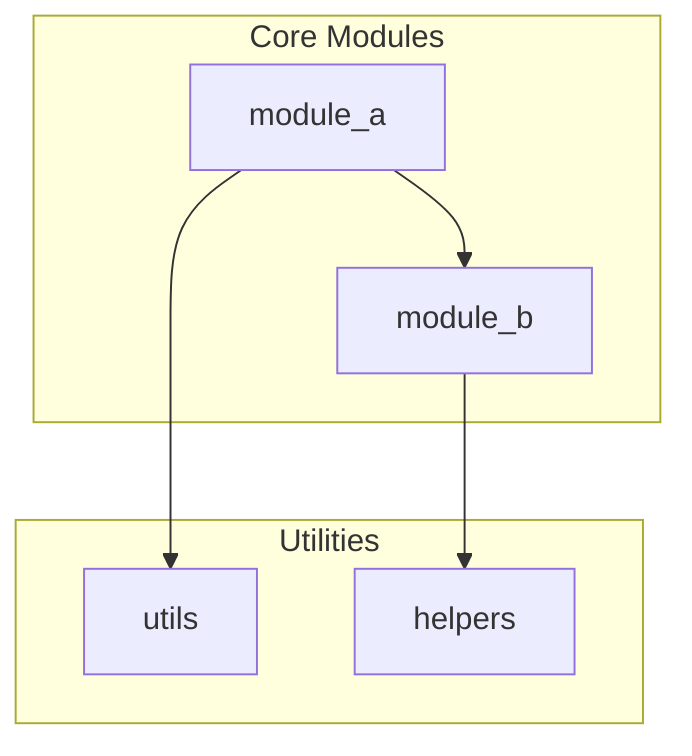
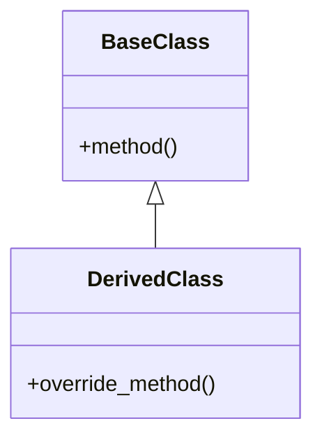
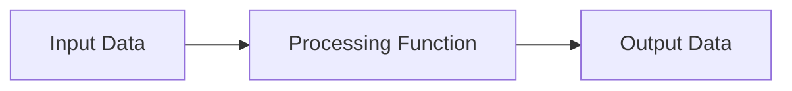
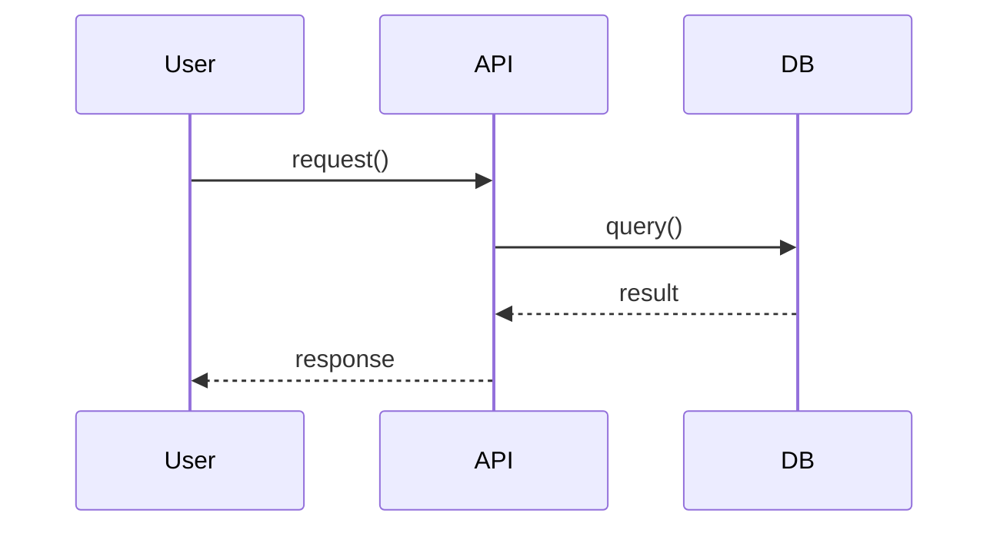

# /docs

Auto-generate and maintain documentation from code. Extract API references, create architecture diagrams in Mermaid format, and keep README.md synchronized with the codebase.

## Usage

```
/docs update                                   # Update all documentation
/docs update README                            # Update only README.md
/docs update diagrams                          # Update only architecture diagrams
/docs update --path <directory>                # Update docs for specific path
/docs preview                                  # Show what would change (dry run)
/docs check                                    # Validate existing documentation
```

## What You Must Do When Invoked

### Step 1 - Scan the codebase

Identify Python files and documentation structure:

```bash
# Find all Python files (respecting .gitignore)
git ls-files '*.py' 2>/dev/null || find . -name '*.py' -not -path '*/\.*'

# Find existing documentation
ls README.md docs/*.md 2>/dev/null
```

Analyze:
- **Package structure**: `__init__.py`, module hierarchy
- **Docstrings**: Module, class, and function docstrings
- **Type hints**: Function signatures, class attributes
- **Imports**: Module dependencies
- **Existing docs**: README, docs folder, inline comments

### Step 2 - Extract API information

For each Python file, extract:

**Module level**:
```python
"""
Module docstring: This describes the module's purpose.
"""
```

**Classes**:
```python
class ClassName:
    """Class docstring describing purpose and usage."""
    
    def __init__(self, param: type) -> None:
        """Initialize with params."""
```

**Functions**:
```python
def function_name(param1: type1, param2: type2 = default) -> ReturnType:
    """Function docstring."""
```

Use Python's AST or simple regex extraction:

```bash
python3 << 'EOF'
import ast
import sys
from pathlib import Path

def extract_api(filepath):
    with open(filepath) as f:
        tree = ast.parse(f.read())
    
    result = {'file': str(filepath), 'classes': [], 'functions': []}
    
    for node in ast.walk(tree):
        if isinstance(node, ast.ClassDef):
            docstring = ast.get_docstring(node) or ''
            methods = [n.name for n in node.body if isinstance(n, ast.FunctionDef)]
            result['classes'].append({
                'name': node.name,
                'docstring': docstring.split('\n')[0] if docstring else '',
                'methods': methods
            })
        elif isinstance(node, ast.FunctionDef) and not node.name.startswith('_'):
            docstring = ast.get_docstring(node) or ''
            args = [arg.arg for arg in node.args.args if arg.arg != 'self']
            result['functions'].append({
                'name': node.name,
                'docstring': docstring.split('\n')[0] if docstring else '',
                'args': args
            })
    
    return result

for pyfile in sys.argv[1:]:
    if Path(pyfile).exists():
        print(extract_api(pyfile))
EOF
```

### Step 3 - Generate/update README.md

Create or update `README.md` with this structure:

```markdown
# <Project Name>

<One-sentence description from main module docstring or inference>

## Overview

<Paragraph explaining what the project does, from module docstrings and context>

## Installation

```bash
# Standard installation (customize based on project)
pip install -e .
# or
pip install -r requirements.txt
```

## Quick Start

```python
# Example usage extracted from docstrings or tests
from <module> import <main_class_or_function>

result = <main_function>(...)
```

## API Reference

### Modules

| Module | Description |
|--------|-------------|
| `<module1>` | <docstring first line> |
| `<module2>` | <docstring first line> |

### Key Classes

#### `ClassName`

<First line of class docstring>

**Methods:**
- `method_name(args)` - <description>

### Key Functions

#### `function_name(args)`

<Function docstring>

**Parameters:**
- `arg1` (type): Description
- `arg2` (type): Description

**Returns:**
- type: Description

## Project Structure

```
<project>/
├── <module1>/      # Purpose
├── <module2>/      # Purpose
├── tests/          # Test suite
├── docs/           # Documentation
└── ...
```

## Configuration

<If config files exist, document them>

## Development

```bash
# Setup development environment
python -m venv .venv
source .venv/bin/activate
pip install -e ".[dev]"

# Run tests
pytest

# Run linting
ruff check .
```

## Architecture

See [Architecture Diagrams](docs/architecture.md) for detailed diagrams.

## Related Documentation

- [Experiments](docs/experiments/) - Research experiments
- [Tasks](docs/TaskNotes/) - Task tracking
- [API Docs](docs/api/) - Full API reference

---

*README auto-generated by docs-from-code skill. Last updated: <date>*
*Edit README.md directly to add custom content, then run `/docs update` to preserve API sections.*
```

**Preserve custom sections**: If README.md exists with content between `<!-- CUSTOM START -->` and `<!-- CUSTOM END -->` markers, preserve that content.

### Step 4 - Generate architecture diagrams (Mermaid)

Create `docs/architecture.md` with Mermaid diagrams:

**1. Module Dependency Graph**



Extract dependencies from imports:
```python
# Parse imports
import ast

def get_dependencies(filepath):
    with open(filepath) as f:
        tree = ast.parse(f.read())
    
    deps = []
    for node in ast.walk(tree):
        if isinstance(node, ast.Import):
            for alias in node.names:
                deps.append(alias.name.split('.')[0])
        elif isinstance(node, ast.ImportFrom):
            if node.module:
                deps.append(node.module.split('.')[0])
    return list(set(deps))
```

**2. Class Inheritance Diagram**



**3. Data Flow Diagram** (if type hints show data transformation)



**4. Sequence Diagram** (for key workflows identified from function call patterns)



### Step 5 - Generate API reference pages

Create `docs/api/` with individual module documentation:

```markdown
# Module: `<module_name>`

<Full module docstring>

## Classes

### `ClassName`

<Full class docstring>

**Methods:**

#### `method_name(args)`

<Method docstring>

**Parameters:**
| Name | Type | Default | Description |
|------|------|---------|-------------|
| arg1 | type | - | Description |

**Returns:**
- `type`: Description

## Functions

### `function_name(args)`

<Function docstring>

**Parameters:**
| Name | Type | Default | Description |
|------|------|---------|-------------|

**Returns:**
- `type`: Description

**Example:**
```python
result = function_name(value)
```
```

### Step 6 - Validate documentation

Run `/docs check` to validate:

1. **All public APIs documented**:
   - Classes without leading underscore
   - Functions without leading underscore
   - Module docstrings present

2. **Diagrams render correctly**:
   - Mermaid syntax valid
   - No circular dependencies in diagrams
   - All referenced modules exist

3. **Links work**:
   - Internal links resolve
   - Cross-references valid

4. **Code examples are valid**:
   - Syntax check examples
   - Imports are correct

Report issues:
```
⚠️ Documentation issues found:

❌ Missing docstring: module_x.py:ClassName
❌ Broken link: docs/architecture.md:45 → nonexistent-module
❌ Invalid Mermaid: docs/architecture.md:78 (unclosed bracket)

✅ 45/48 APIs documented (94%)
✅ All diagrams valid
✅ All links resolve
```

### Step 7 - Report changes

After updating, report:

```
✅ Documentation updated

📄 Files modified:
  - README.md (added API section, updated structure)
  - docs/architecture.md (generated 3 diagrams)
  - docs/api/module_x.md (new)
  - docs/api/module_y.md (new)

📊 Statistics:
  - Modules documented: 5
  - Classes documented: 12
  - Functions documented: 34
  - Diagrams generated: 3

🔍 Coverage:
  - Module docstrings: 5/5 (100%)
  - Class docstrings: 11/12 (92%)
  - Function docstrings: 30/34 (88%)

💡 Suggestions:
  - Add docstring to module_z.py:HelperClass
  - Add examples to utils.py:complex_function
  - Consider splitting large module (2000+ LOC)

📄 Preview:
  - README.md: head -30 README.md
  - Architecture: cat docs/architecture.md | grep -A5 "mermaid"
```

## When to Use This Skill

Use docs-from-code when:

1. **After major refactoring** - Update docs to reflect new structure
2. **Before release** - Ensure documentation is current
3. **New team member** - Generate comprehensive onboarding docs
4. **Code review** - Check documentation coverage
5. **Periodic maintenance** - Run weekly/monthly to keep docs fresh

## Documentation Standards

### Docstring Format (Google Style)

```python
def function(param1, param2):
    """One-line summary.
    
    Extended description if needed.
    
    Args:
        param1: Description
        param2: Description
    
    Returns:
        Description of return value
    
    Raises:
        ExceptionType: When this happens
    """
```

### README Sections (Required)

1. **Project name and description**
2. **Installation instructions**
3. **Quick start example**
4. **API reference** (auto-generated)
5. **Project structure**
6. **Development setup**

### Diagram Guidelines

- **Module graph**: Show all modules, group by package
- **Class diagram**: Show inheritance, key methods
- **Limit complexity**: Split if >20 nodes
- **Use subgraphs**: Group related components

## Anti-Patterns

❌ **Over-documenting**: Every trivial getter doesn't need paragraphs
❌ **Stale examples**: Code examples that don't work
❌ **Wall of text**: Use tables, lists, code blocks for readability
❌ **No structure**: Random sections without logical flow
❌ **Missing context**: API without "why" or "when to use"
❌ **Diagrams that don't add value**: Don't diagram obvious structures

## Custom Sections in README

Preserve human-written content between markers:

```markdown
<!-- CUSTOM START -->
## My Custom Section

This content will be preserved across /docs update runs.
<!-- CUSTOM END -->
```

## Examples

### Example 1: Full documentation update

```
/docs update
```

Scans entire codebase, updates README, generates all diagrams.

### Example 2: Preview changes

```
/docs preview
```

Shows what would change without modifying files.

### Example 3: Update specific module docs

```
/docs update --path src/mypackage/
```

Only updates documentation for specific package.

### Example 4: Check documentation quality

```
/docs check
```

Reports missing docstrings, broken links, invalid diagrams.

## Integration with Other Skills

### handle-task
- Reference documentation updates in task completion
- Link to API docs in MR/PR descriptions

### manage-experiments
- Document experiment code in experiment READMEs
- Link to architecture docs from experiment design

### skill-factory
- Create documentation skills for project-specific conventions
- Generate custom doc templates

## Configuration

Create `.docs-from-code.json` for project-specific settings:

```json
{
  "exclude": ["tests/", "deprecated/"],
  "include_private": false,
  "diagram_types": ["dependency", "class", "sequence"],
  "max_diagram_nodes": 20,
  "docstring_style": "google",
  "custom_readme_sections": ["CUSTOM START", "CUSTOM END"]
}
```

## Quality Metrics

Track documentation quality:

| Metric | Target | How to measure |
|--------|--------|----------------|
| Module coverage | 100% | Modules with docstrings / total modules |
| Class coverage | 90%+ | Classes with docstrings / total classes |
| Function coverage | 80%+ | Functions with docstrings / total functions |
| Example validity | 100% | Examples that run without error |
| Link validity | 100% | Internal links that resolve |
