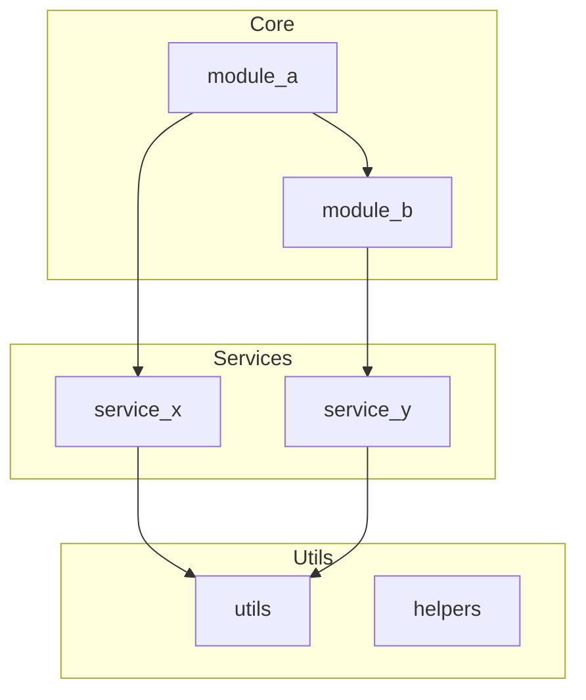
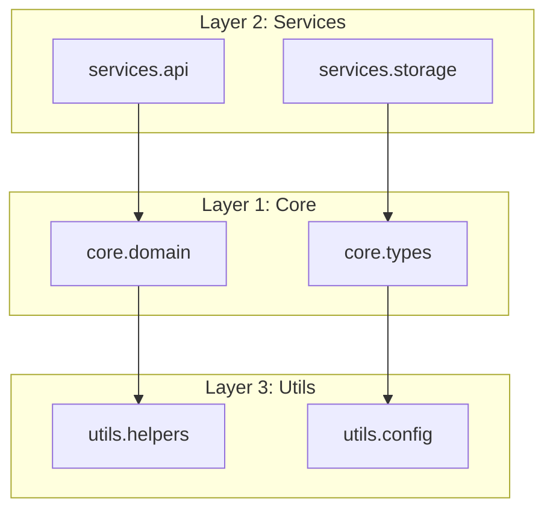

# /overhaul

Conduct comprehensive architecture review. Analyze codebase against UNIX philosophy principles, identify structural issues, and propose reorganization plans. Use after implementing many new features or when codebase feels unwieldy.

## Usage

```
/overhaul                                    # Full architecture review
/overhaul --scope <directory>                # Review specific directory
/overhaul --focus <aspect>                   # Focus on specific aspect
/overhaul --quick                            # Light review (30 min max)
/overhaul --propose                          # Generate reorganization proposal
/overhaul --migrate --plan <proposal.md>     # Execute migration plan
```

## What You Must Do When Invoked

### Step 1 - Gather codebase metrics

Collect quantitative data about the codebase:

```bash
# Lines of code per module
find . -name '*.py' -not -path '*/\.*' -not -path '*/tests/*' | \
  xargs wc -l | sort -n

# Count modules, classes, functions
python3 << 'EOF'
import ast
from pathlib import Path
from collections import Counter

stats = {'modules': 0, 'classes': 0, 'functions': 0, 'loc': 0}
module_sizes = {}

for pyfile in Path('.').rglob('*.py'):
    if '.git' in str(pyfile) or 'test' in str(pyfile):
        continue
    
    try:
        code = pyfile.read_text()
        stats['loc'] += len(code.splitlines())
        stats['modules'] += 1
        module_sizes[str(pyfile)] = len(code.splitlines())
        
        tree = ast.parse(code)
        for node in ast.walk(tree):
            if isinstance(node, ast.ClassDef):
                stats['classes'] += 1
            elif isinstance(node, ast.FunctionDef):
                stats['functions'] += 1
    except:
        pass

print(f"Modules: {stats['modules']}")
print(f"Classes: {stats['classes']}")
print(f"Functions: {stats['functions']}")
print(f"Total LOC: {stats['loc']}")
print(f"\nLargest modules:")
for path, size in sorted(module_sizes.items(), key=lambda x: -x[1])[:10]:
    print(f"  {size:>5} LOC: {path}")
EOF
```

**Metrics to collect:**
- Total modules, classes, functions
- LOC distribution (histogram)
- Import dependency graph
- Test coverage (if tests exist)
- Code duplication estimate

### Step 2 - Analyze against UNIX philosophy

Evaluate codebase against these principles:

**1. Modularity** (One thing, done well)
- [ ] Each module has single responsibility
- [ ] No "god modules" (>500 LOC without clear focus)
- [ ] Clear separation of concerns
- [ ] Utilities don't import domain logic

**2. Clarity** (Clear is better than clever)
- [ ] Module names are descriptive
- [ ] No nested abstractions (>3 levels deep)
- [ ] Minimal "magic" behavior
- [ ] Explicit > implicit

**3. Composability** (Build with Lego, not clay)
- [ ] Functions are pure where possible
- [ ] Clear interfaces between modules
- [ ] Minimal shared mutable state
- [ ] Configuration is externalized

**4. Separation** (Mechanism vs policy)
- [ ] Core logic separate from I/O
- [ ] Business logic separate from framework code
- [ ] Configuration separate from code
- [ ] Interface separate from implementation

**5. Simplicity** (Add, don't subtract)
- [ ] No premature optimization
- [ ] No over-engineering
- [ ] YAGNI followed
- [ ] KISS principle applied

Score each principle: 1-5 (1=violated, 5=exemplary)

### Step 3 - Identify code smells

Look for these anti-patterns:

**God Module** (>500 LOC, >20 functions/classes):
```bash
# Find large modules
find . -name '*.py' -not -path '*/\.*' | \
  xargs wc -l | sort -rn | head -10
```

**Circular Dependencies**:
```bash
# Check for circular imports
python3 << 'EOF'
import ast
from pathlib import Path
from collections import defaultdict

imports = defaultdict(set)

for pyfile in Path('.').rglob('*.py'):
    if '.git' in str(pyfile):
        continue
    
    module_name = str(pyfile).replace('/', '.').replace('.py', '')
    
    try:
        tree = ast.parse(pyfile.read_text())
        for node in ast.walk(tree):
            if isinstance(node, ast.ImportFrom):
                if node.module:
                    imports[module_name].add(node.module.split('.')[0])
    except:
        pass

# Find cycles
for module, deps in imports.items():
    for dep in deps:
        if module in imports.get(dep, set()):
            print(f"Circular: {module} <-> {dep}")
EOF
```

**Code Duplication** (copy-paste >10 lines):
- Look for similar function bodies
- Repeated patterns across modules
- Copy-pasted configuration

**Deep Nesting** (>4 levels):
```python
# Flag functions with deep nesting
def check_nesting(node, depth=0):
    if depth > 4:
        print(f"Deep nesting in {node.name}: {depth} levels")
    for child in ast.iter_child_nodes(node):
        if isinstance(child, (ast.If, ast.For, ast.While, ast.With)):
            check_nesting(child, depth + 1)
```

**Long Parameter Lists** (>5 params):
```python
# Flag functions with many parameters
if len(node.args.args) > 5:
    print(f"Long param list: {node.name} has {len(node.args.args)} params")
```

**Feature Envy** (method uses other class's data more than own):
- Look for `other_obj.attribute` patterns
- Methods that should be free functions

**Data Clumps** (same params passed everywhere):
- Groups of params that appear together
- Should be extracted to data class

### Step 4 - Map dependency graph

Create visual dependency map:



**Identify:**
- **Hub modules**: Many things depend on them (should be stable)
- **Leaf modules**: Depend on many, nothing depends on them (candidates for extraction)
- **Coupling**: Bidirectional dependencies (should be minimized)
- **Layers**: Natural layering (core → services → utils)

### Step 5 - Generate reorganization proposal

Create `docs/architecture-proposals/overhaul-<date>.md`:

```markdown
# Architecture Overhaul Proposal

**Date**: <ISO date>  
**Scope**: <directories analyzed>  
**Time spent**: <X> hours

## Current State

### Metrics

| Metric | Value | Assessment |
|--------|-------|------------|
| Modules | <count> | <good/concern/bad> |
| Classes | <count> | <assessment> |
| Functions | <count> | <assessment> |
| Total LOC | <count> | <assessment> |
| Avg module size | <LOC> | <assessment> |
| Largest module | <name>, <LOC> | <assessment> |

### UNIX Philosophy Scores

| Principle | Score (1-5) | Notes |
|-----------|-------------|-------|
| Modularity | X/5 | <explanation> |
| Clarity | X/5 | <explanation> |
| Composability | X/5 | <explanation> |
| Separation | X/5 | <explanation> |
| Simplicity | X/5 | <explanation> |

**Overall**: <X>/25 - <rating>

## Identified Issues

### Critical (fix immediately)

1. **God Module: `<module>`** (<LOC> LOC)
   - **Problem**: Does too much, hard to test, unclear responsibility
   - **Impact**: Blocks new features, bug magnet
   - **Fix**: Split into 3-4 focused modules

2. **Circular Dependency: `<A>` ↔ `<B>`**
   - **Problem**: Can't change one without other, tight coupling
   - **Impact**: Fragile, hard to reason about
   - **Fix**: Extract shared interface to `<C>`

### Important (fix soon)

3. **Code Duplication**: <X> instances of similar patterns
   - **Location**: <files>
   - **Fix**: Extract to utility module

4. **Deep Nesting**: <N> functions with >4 levels
   - **Impact**: Hard to read, error-prone
   - **Fix**: Extract helper functions, early returns

### Nice-to-have (fix when convenient)

5. **Long Parameter Lists**: <N> functions with >5 params
6. **Inconsistent Naming**: <examples>
7. **Missing Abstractions**: <opportunities>

## Proposed Reorganization

### Target Architecture



### Module Moves

| Current | Proposed | Rationale |
|---------|----------|-----------|
| `utils/db.py` | `services/storage.py` | DB is service, not utility |
| `main.py:Config` | `config/settings.py` | Config deserves own module |
| `api/handlers.py` | `api/v1/handlers.py` | Prepare for versioning |

### Module Splits

**`large_module.py`** (800 LOC) → Split into:
- `large_module/core.py` (300 LOC) - Core logic
- `large_module/io.py` (200 LOC) - I/O operations
- `large_module/types.py` (150 LOC) - Type definitions
- `large_module/utils.py` (150 LOC) - Helper functions

### New Abstractions

1. **Extract `DataProcessor` class**
   - Currently: 5 functions with similar patterns
   - Proposed: Single class with strategy pattern

2. **Create `Config` dataclass**
   - Currently: 8 functions pass same 5 params
   - Proposed: Single config object

## Migration Plan

### Phase 1: Preparation (1-2 days)
- [ ] Add comprehensive tests for current behavior
- [ ] Document current interfaces
- [ ] Set up CI to catch regressions

### Phase 2: Core Changes (2-3 days)
- [ ] Extract types to separate module
- [ ] Split god module
- [ ] Fix circular dependencies

### Phase 3: Cleanup (1-2 days)
- [ ] Remove dead code
- [ ] Standardize naming
- [ ] Update documentation

### Phase 4: Validation (1 day)
- [ ] Run full test suite
- [ ] Performance benchmark
- [ ] User acceptance testing

## Risks and Mitigations

| Risk | Likelihood | Impact | Mitigation |
|------|------------|--------|------------|
| Breaking changes | Medium | High | Comprehensive tests |
| Performance regression | Low | Medium | Benchmark before/after |
| Team disruption | Medium | Medium | Incremental rollout |

## Success Criteria

- [ ] All tests pass
- [ ] No critical code smells remain
- [ ] UNIX philosophy score >20/25
- [ ] Team agrees structure is clearer
- [ ] New feature development is faster

## Appendix

### Detailed Metrics
<Full metric tables>

### Dependency Graph
<Full mermaid diagram>

### Code Examples
<Before/after comparisons>

---

*Generated by overhaul skill*
```

### Step 6 - Present findings to user

Report key findings:

```
📊 Architecture Review Complete

**Scope**: <directories>
**Time**: <duration>

## Summary

**UNIX Philosophy Score**: <X>/25 (<rating>)

| Principle | Score |
|-----------|-------|
| Modularity | X/5 |
| Clarity | X/5 |
| Composability | X/5 |
| Separation | X/5 |
| Simplicity | X/5 |

## Critical Issues (must fix)

❌ <Issue 1>: <one-line description>
❌ <Issue 2>: <one-line description>

## Important Issues (should fix)

⚠️ <Issue 3>: <one-line description>
⚠️ <Issue 4>: <one-line description>

## Proposal Generated

📄 `docs/architecture-proposals/overhaul-<date>.md`

Contains:
- Full analysis with metrics
- Proposed target architecture
- Step-by-step migration plan
- Risk assessment

## Next Steps

1. Review proposal: `cat docs/architecture-proposals/overhaul-<date>.md`
2. Discuss with team (if applicable)
3. Run: `/overhaul --migrate --plan docs/architecture-proposals/overhaul-<date>.md`

💡 Recommendation: <specific advice based on findings>
```

### Step 7 - Execute migration (if requested)

For `/overhaul --migrate --plan <proposal.md>`:

1. **Read migration plan**
2. **Create migration branch**:
   ```bash
   git checkout -b overhaul/migration-<date>
   ```
3. **Execute phase by phase**:
   - Run tests before each phase
   - Make changes incrementally
   - Run tests after each phase
   - Commit each phase separately
4. **Report progress** after each phase
5. **Final validation** when complete

## When to Use This Skill

Use overhaul when:

1. **After major feature additions** - Every 3-5 major features
2. **Codebase feels unwieldy** - Hard to find things, frequent bugs
3. **Before scaling team** - Clean structure before onboarding
4. **Performance issues** - Often structural, not algorithmic
5. **Technical debt review** - Quarterly or biannual maintenance

## UNIX Philosophy Checklist

### Modularity (One thing, done well)
- [ ] Each module has single, clear purpose
- [ ] Modules are <200 LOC ideally, <500 max
- [ ] No "kitchen sink" modules
- [ ] Easy to explain what each module does

### Clarity (Clear > clever)
- [ ] Names are descriptive, not cute
- [ ] No nested abstractions >3 deep
- [ ] Obvious how to use APIs
- [ ] Minimal "magic" or side effects

### Composability (Lego, not clay)
- [ ] Functions work independently
- [ ] Clear interfaces between modules
- [ ] Minimal shared state
- [ ] Configuration externalized

### Separation (Mechanism vs policy)
- [ ] Core logic separate from I/O
- [ ] Business logic separate from framework
- [ ] Interface separate from implementation
- [ ] What vs how separated

### Simplicity (Add, don't subtract)
- [ ] No premature optimization
- [ ] No over-engineering
- [ ] YAGNI followed
- [ ] KISS principle applied

## Anti-Patterns

❌ **Big Ball of Mud**: No clear structure
❌ **Golden Hammer**: One pattern forced everywhere
❌ **Premature Abstraction**: Abstracting before understanding
❌ **Cargo Cult**: Copying patterns without understanding why
❌ **Resume-Driven Development**: Over-engineering for complexity's sake
❌ **Not Invented Here**: Rejecting good solutions because external

## Examples

### Example 1: Full overhaul

```
/overhaul
```

Takes 2-4 hours for medium codebase (~10k LOC).

### Example 2: Quick review

```
/overhaul --quick
```

30-minute focused review, top 5 issues only.

### Example 3: Focus on specific aspect

```
/overhaul --focus modularity
```

Deep dive into module structure only.

### Example 4: Execute migration

```
/overhaul --migrate --plan docs/architecture-proposals/overhaul-2026-08-19.md
```

Executes approved migration plan phase by phase.

## Output Artifacts

1. **`docs/architecture-proposals/overhaul-<date>.md`** - Full proposal
2. **`docs/architecture.md`** - Updated architecture docs
3. **Migration branch** - If `--migrate` used
4. **Metrics snapshot** - For tracking improvement over time

## Follow-up

After overhaul:
1. Schedule next review (3-6 months)
2. Track metrics over time
3. Celebrate improvements
4. Learn from what worked/didn't
